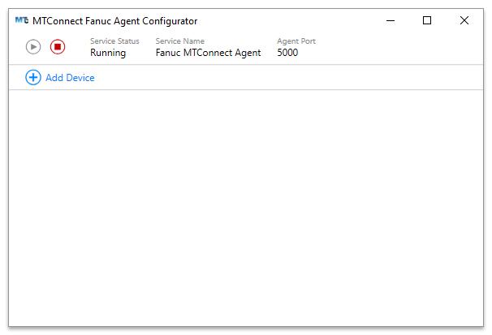

# Fanuc MTConnect Agent
MTConnect Agent for Fanuc CNC Equipment using Focas over Ethernet

### Configurator
The Configurator provides a user interface to configure and manage the MTConnect Agent and Adapters. The Agent is setup during install and each Adapter can be added/removed using the Configurator. When a device is added, the appropriate adapter is installed, the adapter is added to the agent.cfg file, and the Device is added to the devices.xml file.

### Agent
The agent is based on the cppagent project available at https://github.com/mtconnect/cppagent.

### Adapters
The adapters are based on the Fanuc adapter that is part of the project available at https://github.com/mtconnect/adapter/tree/master/fanuc.

## Installation

*Compatible with 0id and 30i Fanuc Controllers supporting Fanuc Focas over Ethernet*

*Installation requres Administrator privileges and may display UAC dialogs which must be accepted throughout the installation process*

### Step 1

Download the latest [Release](../../../TrakHound/releases/) and run the installer executable on a PC networked to the Fanuc Controller. Select the directory to install the Agent (typically the default path is acceptable) and click **Next**.

### Step 2

Select the name of the Start Menu directory to create shortcuts in (typically the default is acceptable) and click **Next**.

### Step 3

Confirm the installation setup and click **Install** to proceed with the installation.

### Step 4

Confirm that the check box to "View Fanuc-MTConnect-Agent-Configurator.exe" is checked and click **Finish**.

### Step 5

The Configurator will open with the MTConnect Agent options at the top of the window. At this point, no Fanuc Adapters are installed. To install a Fanuc Adapter, click the **Add Device** button.

### Step 6

The Add Device dialog will open with the list of available controller types on the left side. Click the controller type matching the Fanuc control you are connecting to. 
*(Note: controller types are listed by "family". For example, a 31i controller would use the 30i Adapter)*

### Step 7

Enter the IP Address of the Fanuc Controller. You can also enter in descriptive information about the machine in the fields provided which will be added to the MTConnect Device Header. Once the information is entered, click **Add**.

### Step 8

The Device will now appear in the list on the Configurator window and should be displaying the "Changing" status. The Adapter for the device is installed as a Windows Service and the Configurator monitors and controls the service.

### Step 9

Once the status for the newly added Device changes to "Started", the Agent is ready to be used and can be accessed using a web browser (Firefox, Chrome, IE, etc.) by navigating to "http://127.0.0.1:5000/current". Once all of the devices needed are setup, you can close the Configurator window.

